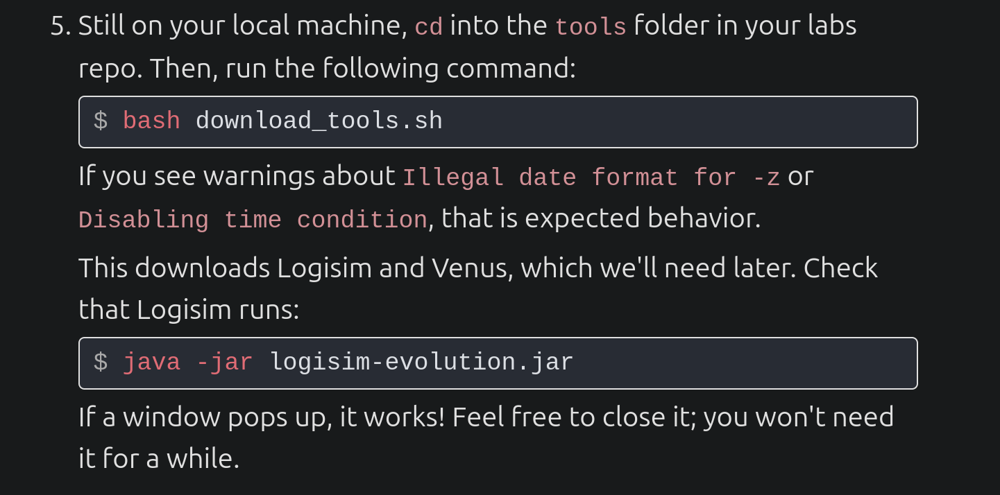
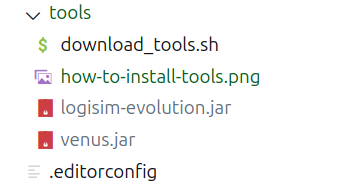

### 2024/12/8 9:40: Downdoad from: https://github.com/61c-teach/fa24-lab-starter

```bash
$ sudo apt update
$ sudo apt install curl git openjdk-17-jre openssh-client python3 python3-pip
```



### After installing tools, you will find two .jar files in the "tools" folder

